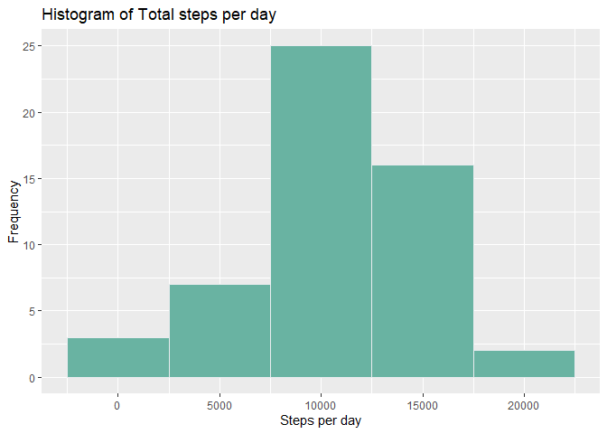
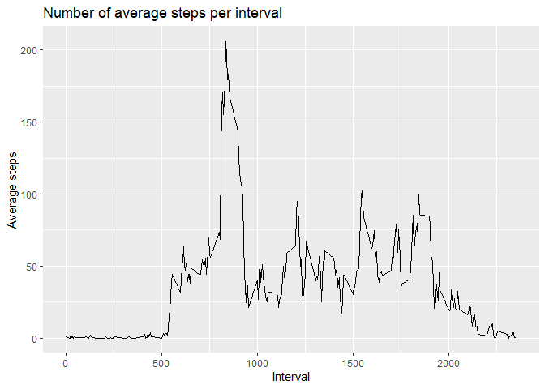
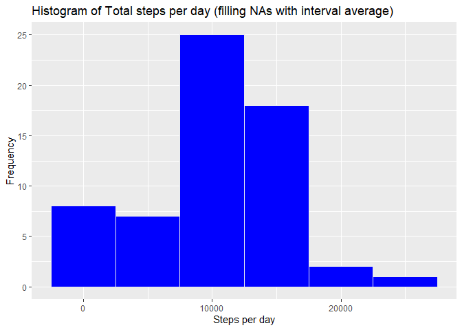
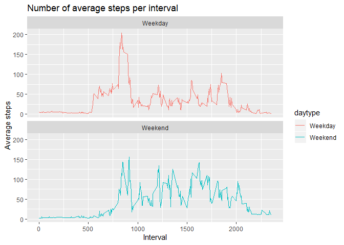

Loading data
============

Reading data from a csv file and displaying the file head

    data<-read.csv("activity.csv")
    head(data)

    ##   steps       date interval
    ## 1    NA 2012-10-01        0
    ## 2    NA 2012-10-01        5
    ## 3    NA 2012-10-01       10
    ## 4    NA 2012-10-01       15
    ## 5    NA 2012-10-01       20
    ## 6    NA 2012-10-01       25

    summary(data)

    ##      steps                date          interval     
    ##  Min.   :  0.00   2012-10-01:  288   Min.   :   0.0  
    ##  1st Qu.:  0.00   2012-10-02:  288   1st Qu.: 588.8  
    ##  Median :  0.00   2012-10-03:  288   Median :1177.5  
    ##  Mean   : 37.38   2012-10-04:  288   Mean   :1177.5  
    ##  3rd Qu.: 12.00   2012-10-05:  288   3rd Qu.:1766.2  
    ##  Max.   :806.00   2012-10-06:  288   Max.   :2355.0  
    ##  NA's   :2304     (Other)   :15840

What is mean total number of steps taken per day?
=================================================

### 1. Caculate the number of steps per date

We use the aggregate function, sum the steps by date ommiting NA values

    steps_by_day<-aggregate(steps ~ date, data = data, sum,na.action = na.omit)

### 2. Plotting histogram

Using ggplot2 to create the histogram of total number of steps taken
each day.

    library(ggplot2)
    ggplot(steps_by_day, aes(x=steps)) + 
      geom_histogram(binwidth = 5000, fill="#69b3a2", color="#e9ecef") +
      labs(title = "Histogram of Total steps per day", x="Steps per day", y="Frequency")

### 3. Calculate and report the mean and median of the total number of steps taken per day

    dailymean<-as.integer(mean(steps_by_day$steps))
    dailymedian<- as.integer(median(steps_by_day$steps))

Daily Mean is 10766 

Daily Median is 10765

What is the average daily activity pattern?
===========================================

### 1. Make a time series plot (i.e. type=“l”) of the 5-minute interval (x-axis) and the average number of steps taken, averaged across all days (y-axis)

    average_steps_by_interval<-aggregate(steps ~ interval, data = data, mean,na.action = na.omit)
    ggplot(data=average_steps_by_interval, aes(x=interval, y=steps)) + geom_line() +
    labs(title = "Number of average steps per interval", x="Interval", y="Average steps") 

\#\#\# 2. Which 5-minute interval, on average across all the days in the
dataset, contains the maximum number of steps?

    max_mean<-max(average_steps_by_interval$steps)
    intervals<-subset(average_steps_by_interval,steps==max_mean)
    max_interval<-intervals$interval

Max average number of steps was 206.1698113 on the interval 835

Imputing missing values
=======================

### 1. Calculate and report the total number of missing values in the dataset (i.e. the total number of rows with NAs)

    missing_rows <- nrow(subset(x=data,is.na(steps)))

Total number of missing values is 2304

### 2. Devise a strategy for filling in all of the missing values in the dataset. The strategy does not need to be sophisticated. For example, you could use the mean/median for that day, or the mean for that 5-minute interval, etc. 

We will fill the NA values with the mean for the correspondent
interval(calculated previously on the average daily activity pattern).

### 3. Create a new dataset that is equal to the original dataset but with the missing data filled in.

    nas <- subset(x=data,is.na(steps))
    nas <- subset(nas, select = -c(steps) )
    nas<-merge(nas, average_steps_by_interval, by = "interval")
    nas$steps<-as.integer(nas$steps)
    data_filling_NA <- data
    data_filling_NA$steps <- ifelse(is.na(data_filling_NA$steps) == TRUE, nas$steps[nas$interval %in% data_filling_NA$interval],data_filling_NA$steps) 

### 4. Make a histogram of the total number of steps taken each day and Calculate and report the mean and median total number of steps taken per day. Do these values differ from the estimates from the first part of the assignment? What is the impact of imputing missing data on the estimates of the total daily number of steps?

    steps_by_day_filling_NAs<-aggregate(steps ~ date, data = data_filling_NA, sum,na.action = na.omit)
    ggplot(steps_by_day_filling_NAs, aes(x=steps)) + 
      geom_histogram(binwidth = 5000, fill="blue", color="#e9ecef") +
      labs(title = "Histogram of Total steps per day (filling NAs with interval average)", x="Steps per day", y="Frequency")

    dailymean_filing_NAs<-as.integer(mean(steps_by_day_filling_NAs$steps))
    dailymedian_filling_NAs<- as.integer(median(steps_by_day_filling_NAs$steps))

    dif_mean<-(dailymean-dailymean_filing_NAs)*100/dailymean
    dif_median<-(dailymedian-dailymedian_filling_NAs)*100/dailymedian

    text_mean<-ifelse(dif_mean<0,"an increse"," a decrease")
    text_median<-ifelse(dif_median<0,"an increse","a decrease")

The new daily Mean is 10286 which indicate a decrease of 4.4584804 % 

The new daily Median is 10600 which indicate a decrease of 1.532745%

Are there differences in activity patterns between weekdays and weekends?
=========================================================================

### 1.Create a new factor variable in the dataset with two levels – “weekday” and “weekend” indicating whether a given date is a weekday or weekend day.

    data_filling_NA$date<-as.Date(data_filling_NA$date)
    data_filling_NA$daytype <- weekdays(data_filling_NA$date)
    data_filling_NA$daytype <- ifelse(weekdays(data_filling_NA$date) %in% c("Saturday","Sunday"),"Weekend","Weekday")

### 2.Make a panel plot containing a time series plot (i.e. type=“l”) of the 5-minute interval (x-axis) and the average number of steps taken, averaged across all weekday days or weekend days (y-axis).

number of steps taken, averaged across all days (y-axis)

    average_steps_by_interval_daytype<-aggregate(steps ~ interval + daytype, data = data_filling_NA, mean)
    ggplot(data=average_steps_by_interval_daytype, aes(x=interval, y=steps, color=daytype)) + geom_line() +
      facet_wrap(~daytype, ncol = 1, nrow=2) +
    labs(title = "Number of average steps per interval", x="Interval", y="Average steps") 

